# arc42 Architekturdokumentation – Knitting Quarterly Bingo

> Basierend auf arc42 Template Version 8 (<https://arc42.org>)

---

## 1. Einführung und Ziele

### 1.1 Aufgabenstellung

Knitting Quarterly Bingo ist eine browserbasierte Einzelplatz-Webanwendung, mit der Strickerinnen und Stricker ein persönliches Bingo-Spielfeld fuer ein Strick-Quartal befuellen und waehrend des Quartals ihren Fortschritt verfolgen koennen.

Die Anwendung unterstützt zwei Phasen:

1. **Planungsphase**: Der Quartalsplan wird als Liste von Challenges (Strick-Vorhaben) zusammengestellt. Zu jeder Challenge kann ein Planungsbild (z. B. Inspirationsfoto aus Ravelry) hinterlegt werden.
2. **Spielphase**: Das Bingo-Brett wird angezeigt. Erfüllte Challenges werden abgehakt. Zu jeder erfüllten Challenge kann ein Fortschrittsfoto hochgeladen werden. Werden genug Challenges in einer Zeile, Spalte oder Diagonale abgehakt, entsteht Bingo.

### 1.2 Qualitätsziele

| Priorität | Qualitätsmerkmal | Konkrete Ausprägung |
| --- | --- | --- |
| 1 | Offline-Fähigkeit | Keine Serverabhängigkeit; alles im Browser persistiert |
| 2 | Einfache Bedienbarkeit | Wenige Screens, direktes Interaktionsmodell |
| 3 | Datenkonsistenz | Spielstand wird bei jedem Schritt gespeichert; kein Datenverlust bei Reload |
| 4 | Testbarkeit | Domänenlogik ist framework-unabhängig und vollständig unit-testbar |
| 5 | Erweiterbarkeit | Ports-and-Adapters erlaubt Austausch von Storage-Technologien |

### 1.3 Stakeholder

| Rolle | Erwartung |
| --- | --- |
| Strickerin / Stricker | Einfache, schnelle App zum Tracken des eigenen Quartals-Bingos |
| Entwicklerin | Klare Architektur, gute Testbarkeit, keine externe Abhängigkeiten im Betrieb |

---

## 2. Randbedingungen

### Technische Randbedingungen

- **Laufzeitumgebung**: Moderner Webbrowser (Chrome, Firefox, Safari)
- **Kein Backend**: Vollständige Client-Side-Applikation, keine Server-Komponente
- **Persistence**: Browser-APIs (LocalStorage für strukturierte Daten, IndexedDB für Bilder)
- **Framework**: Angular 21+ (Standalone Components, Signals)
- **Sprache**: TypeScript
- **Tests**: Vitest (Unit) und Playwright (E2E)

### Organisatorische Randbedingungen

- Betrieb als statische Webanwendung (via Docker / nginx oder direkt aus `dist/`)
- Keine Benutzerkonten, kein Login – alle Daten bleiben lokal im Browser

---

## 3. Kontextabgrenzung

### 3.1 Systemkontext

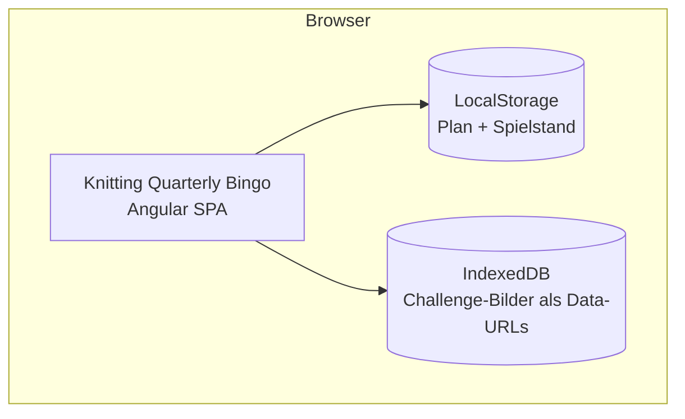

**Externe Schnittstellen:** keine. Die Anwendung kommuniziert ausschließlich mit Browser-APIs.

---

## 4. Lösungsstrategie

| Entscheidung | Begründung |
| --- | --- |
| **Domain-Driven Design** | Komplexe Domänenlogik (Bingo-Erkennung, Spielstand-Validierung, Bild-Konzepte) lebt isoliert im Domain-Layer |
| **Ports and Adapters** | Storage-Technologien (LocalStorage, IndexedDB) sind austauschbar; Domäne kennt nur Interfaces (Ports) |
| **Immutable Aggregate + Value Objects** | `QuarterlyPlan`, `BingoGame` und `KnittingQuarterly` kapseln fachliche Regeln ohne Seiteneffekte; jede Mutation liefert eine neue Instanz |
| **Angular Signals** | Reaktiver State ohne RxJS-Overhead; UseCases halten `signal<Aggregate>()` und leiten `computed()`-Werte ab |
| **Feature-Slice-Struktur** | Klare Trennung nach Features mit eigenem domain/application/infrastructure/presentation-Stack |
| **Atomic Design (UI)** | UI-Komponenten sind als Tokens, Atoms, Molecules und Organisms strukturiert; fördert Wiederverwendung, konsistentes Design und klare Verantwortlichkeiten in der Presentation-Schicht |

### 4.1 Ubiquitous Language (aktuell)

Die kanonische Fachsprache in der Domäne lautet:

- **QuarterlyPlan**: Plan fuer genau ein Quartal mit 16 Challenges.
- **Challenge**: Einzelnes Vorhaben mit optionalem Planungsbild.
- **BingoGame**: Spiel-Fortschritt eines Quartals auf Basis eines gespeicherten Plans (`QuarterlyPlan`).
- **KnittingQuarterly**: Fachobjekt fuer ein Quartal, dessen Phase (`past` | `current` | `future`) aus `quarterId` und aktuellem Quartal abgeleitet wird; die Phase steuert, ob ein Quartal spielbar ist.
- **ArchiveEntry**: Historischer Snapshot eines abgeschlossenen Quartals.

`quarterId` ist der natürliche fachliche Schlüssel fuer `QuarterlyPlan`, `BingoGame` und `ArchiveEntry`. Zusätzliche Objekt-IDs werden im Domänenmodell nicht benötigt.

---

## 5. Bausteinsicht

### 5.1 Drilldown-Navigation

Die Bausteinsicht ist bewusst mehrstufig aufgebaut, damit ein schrittweises "Reindrillen" moeglich ist:

1. **Ebene 1 (Gesamtsystem):** Ein Hexagon auf Systemebene mit Layern, InPorts, UseCases, OutPorts und Adaptern.
2. **Ebene 2 (Feature-Slices):** Verantwortlichkeiten je Slice.
3. **Ebene 3 (Pro Feature):** Eigene hexagonale Sicht mit konkreten InPorts, UseCases, OutPorts, Adaptern und Domain-Objekten.
4. **Domain-Modell:** Ein globales Modell fuer das gemeinsame Verstaendnis plus fokussierte Sichten pro Feature.

### 5.2 Ebene 1 – Gesamtsystem (Hexagon)

> Diagramm-Quelle: [diagrams/hexagon-overview.drawio](./diagrams/hexagon-overview.drawio) (mit VS Code Extension "Draw.io Integration" oeffnen)

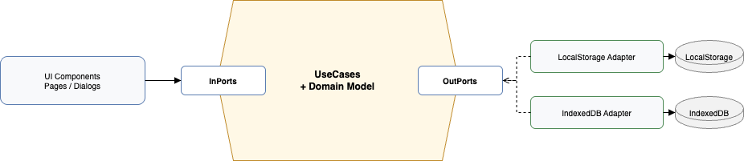

Abhaengigkeitsregel: innen kennt nichts von aussen. Primary und Secondary Adapter haengen von Ports ab, nicht die Domain von Adaptern.

Namensregel: siehe ADR-005 (Kapitel 9) fuer die verbindliche Benennung von InPorts, OutPorts, UseCases sowie `persist...` vs. `save...`.

### 5.3 Ebene 2 – Feature-Slices (Verantwortlichkeiten)

| Slice | InPort | UseCase | OutPorts | Adapter | Domain-Fokus |
| --- | --- | --- | --- | --- | --- |
| quarterly-plan | `PlanQuarterlyInPort` | `PlanQuarterlyUseCase` | `LoadQuarterlyPlanOutPort`, `PersistQuarterlyPlanOutPort` | `LocalStorageQuarterlyPlanRepository` | `QuarterlyPlan`, `Challenge` |
| bingo-game | `PlayBingoInPort` | `PlayBingoUseCase` | `LoadBingoProgressOutPort`, `PersistBingoProgressOutPort`, Nutzung von `LoadQuarterlyPlanOutPort` | `LocalStorageBingoGameRepository`; Presentation inkl. `PrintBingoBoardComponent` | `BingoGame`, `ChallengeProgress` |
| bingo-game (Start) | `StartBingoFromPlanInPort` | `StartBingoFromPlanUseCase` | `LoadQuarterlyPlanOutPort`, `PersistQuarterlyPlanOutPort`, `PersistBingoProgressOutPort` | – (nutzt bestehende Adapter) | QuarterId-Mapping, Cross-Quarter-Persistenz |
| archive | `ShowArchiveOverviewInPort` | `ShowArchiveOverviewUseCase` | `LoadArchiveEntriesOutPort` | `LocalStorageArchiveRepository` | `ArchiveEntry` |
| core / quarter-lifecycle | `EnsureQuarterRolloverInPort` | `EnsureQuarterRolloverUseCase` | nutzt aktuell `QUARTERLY_PLAN_READER`/`QUARTERLY_PLAN_WRITER` und `BINGO_GAME_REPOSITORY` (Migration auf OutPorts folgt) | kein eigener Storage-Adapter | `QuarterClock`, `QuarterId` |
| shared image storage | n/a (derzeit) | n/a (derzeit) | `ImageRepository` | `IndexedDbImageRepository` | Bild-UUID-Referenzen |

### 5.4 Ebene 3 – Feature-spezifische Hexagon-Sichten

#### 5.4.1 quarterly-plan

> Diagramm-Quelle: [diagrams/hexagon-quarterly-plan.drawio](./diagrams/hexagon-quarterly-plan.drawio)

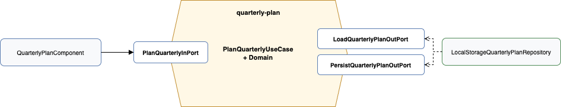

#### 5.4.2 bingo-game

> Diagramm-Quelle: [diagrams/hexagon-bingo-game.drawio](./diagrams/hexagon-bingo-game.drawio)

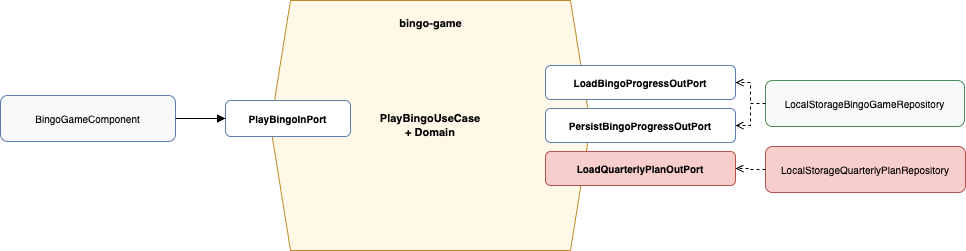

#### 5.4.3 archive

> Diagramm-Quelle: [diagrams/hexagon-archive.drawio](./diagrams/hexagon-archive.drawio)

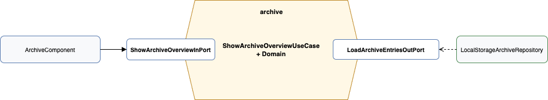

#### 5.4.4 core / quarter-lifecycle

> Diagramm-Quelle: [diagrams/hexagon-quarter-lifecycle.drawio](./diagrams/hexagon-quarter-lifecycle.drawio)

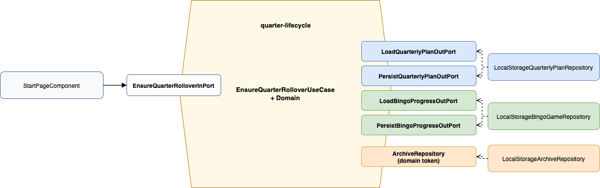

### 5.5 Domain-Modell

#### 5.5.1 Globales Domain-Modell (systemweit)

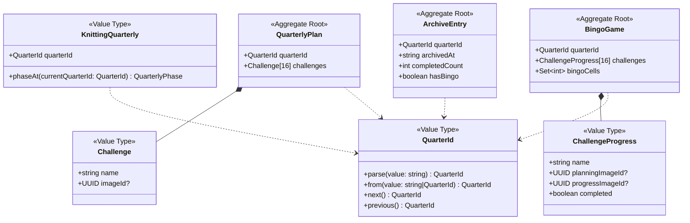

#### 5.5.2 Domain-Sichten pro Feature

- **quarterly-plan:** `QuarterlyPlan`, `Challenge`
- **bingo-game:** `BingoGame`, `ChallengeProgress` (inkl. Bingo-Erkennung)
- **archive:** `ArchiveEntry` als historischer Snapshot
- **core / quarter-lifecycle:** `QuarterClock`, `QuarterId`, `KnittingQuarterly` fuer Zeit-/Phasenlogik

---

## 6. Laufzeitsicht

### Szenario 1: Erstaufruf – kein Plan vorhanden

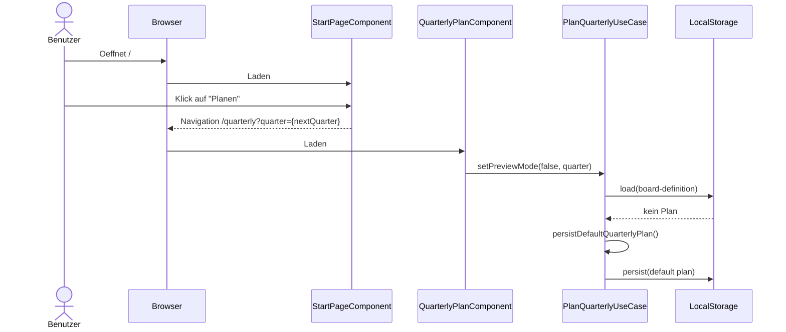

### Szenario 1b: Quartalswechsel (Rollover)

Der `EnsureQuarterRolloverUseCase` wird beim App-Start aufgerufen und prueft, ob fuer das aktuelle Quartal bereits ein Board existiert. Die **Existenz des Boards als Domaenen-Invariante** ersetzt einen separaten technischen Cursor.

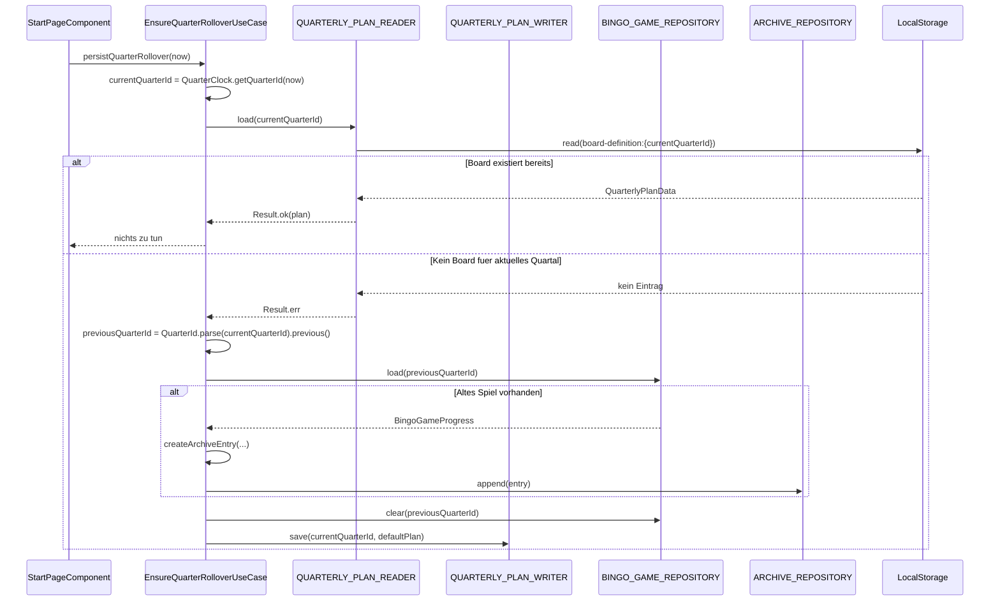

**Entscheidung:** Kein separater `QuarterRolloverCursor` nötig – die Abwesenheit eines Boards für das aktuelle Quartal ist die natürliche Invariante dafür, dass ein Rollover noch aussteht.

### Szenario 2: Plan bearbeiten

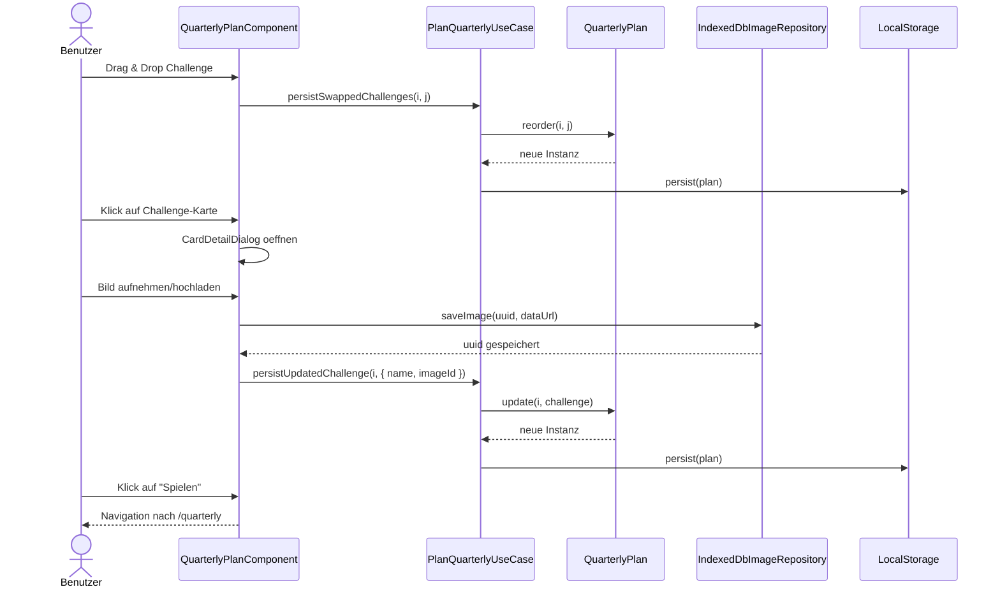

### Szenario 2b: Jetzt spielen – Plan eines anderen Quartals als neues Bingo starten

Über den **Play-Button im Planungsboard** kann der Benutzer einen Plan (auch eines zukünftigen Quartals) sofort als Bingo starten. Die Challenges werden unter der aktuellen `quarterId` gespeichert und der bisherige Fortschritt wird hart zurückgesetzt.

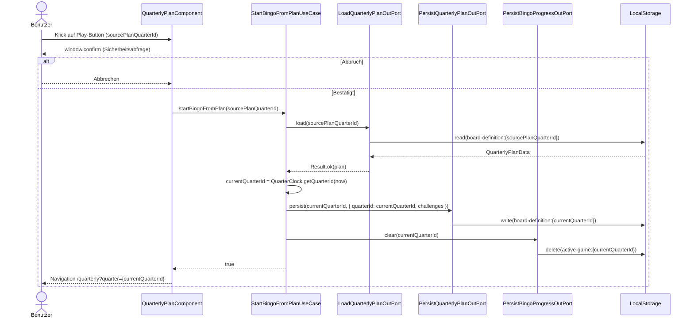

**Kernentscheidungen in diesem Szenario:**

- `sourcePlanQuarterId` (angezeigtes Planquartal) ≠ `currentQuarterId` (Ziel-Quartal des neuen Spiels): Das Mapping ist explizit im `StartBingoFromPlanUseCase` gekapselt.
- Bestehender Bingo-Fortschritt im aktuellen Quartal wird hart gelöscht; die `QuarterlyViewPage` initialisiert beim Navigieren automatisch ein neues Spiel aus dem persistierten Plan.

### Szenario 3: Spiel spielen

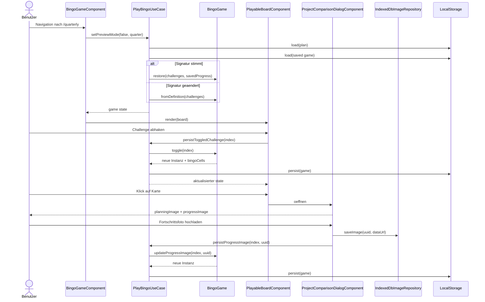

### Szenario 3b: Board drucken

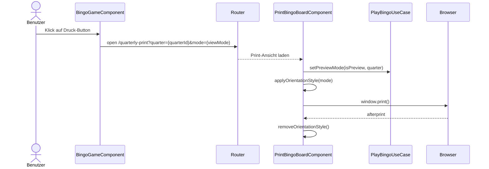

Die Druckausrichtung wird mode-abhaengig gesetzt: `polaroid -> portrait`, `kompakt -> landscape`.

### 6.4 Zustandsmodell – Spiellebenszyklus

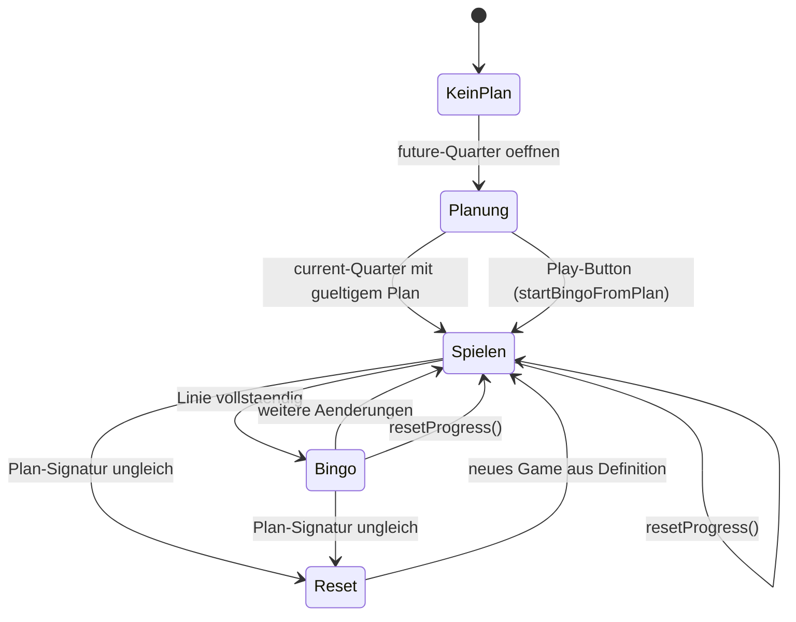

> **Play-Button-Übergang:** `Planung → Spielen` (via `StartBingoFromPlanUseCase`) ist ein expliziter Hard-Reset-Pfad. Der Plan des angezeigten Quartals wird unter der aktuellen `quarterId` persistiert, der bestehende Fortschritt gelöscht und anschließend zur Spielansicht des aktuellen Quartals navigiert.

| Zustand | Bedeutung |
| --- | --- |
| `KeinPlan` | Fuer das gewaehlte Quartal existiert noch kein gueltiger `QuarterlyPlan`. |
| `Planung` | Das Board wird bearbeitet (Challenges, Reihenfolge, Bilder). |
| `Spielen` | Das aktive Spiel laeuft; Fortschritt wird per Toggle/Foto aktualisiert und persistiert. |
| `Bingo` | Mindestens eine vollstaendige Linie wurde erreicht. |
| `Reset` | Der bisherige Spielstand wird verworfen und aus der aktuellen Plan-Definition neu aufgebaut. |

---

## 7. Verteilungssicht

Die Anwendung wird als statische Webanwendung ausgeliefert.

- Aktueller Betrieb: GitHub Pages
- Vorbereitet fuer spaeter: Container-Betrieb via Docker/nginx

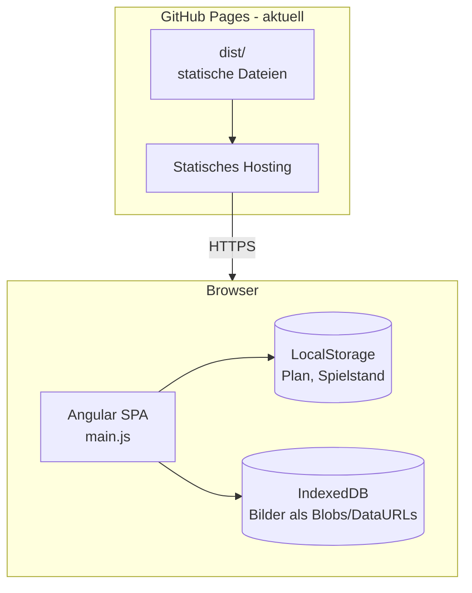

**Deployment (aktuell):** GitHub Pages mit statischen Build-Artefakten (`dist/`).

**Deployment (vorbereitet):** `Dockerfile` und `docker-compose.yml` sind als zukuenftige Option fuer einen Container-Betrieb mit nginx vorhanden.

---

## 8. Querschnittliche Konzepte

### 8.1 Persistenz-Strategie

Zwei Storage-Technologien, klar nach Datentyp getrennt:

| Daten | Technologie | Schlüssel |
| --- | --- | --- |
| Quartalsplan | LocalStorage | `kq-bingo-board-definition-v3:{quarterId}` (Legacy: `...-v2`) |
| Spielfortschritt | LocalStorage | `kq-bingo-active-game-v4:{quarterId}` (Legacy: `...-v3`) |
| Challenge-Bilder (Planung + Fortschritt) | IndexedDB | UUIDs als Objekt-Store-Keys |

Bilder werden **nie** direkt im Plan oder Spielstand gespeichert – nur ihre UUIDs. Das hält LocalStorage klein und ermöglicht große Bilder in IndexedDB.

### 8.2 Datenmigration

Beide Repositories enthalten automatische Migrationslogik beim Laden:

- `LocalStorageQuarterlyPlanRepository`: Legacy-Daten ohne `quarterId` werden auf das quartalsbezogene v3-Format migriert.
- `LocalStorageBingoGameRepository`: v2 (separate `cellImages[]` + `completed[]`-Arrays) -> v3/v4 (`ChallengeProgress[]`, quartalsbezogen)

Migrationen laufen transparent beim ersten Laden nach einem Update. Legacy-Schluessel bleiben bei der Migration erhalten; beim expliziten `clear(currentQuarter)` werden v2/v3-Kompatibilitaetsschluessel bereinigt.

### 8.3 Unveränderliche Domänen-Aggregate

Alle Aggregate (`KnittingQuarterly`, `BingoGame`, `QuarterlyPlan`) sind immutable:

- Private Konstruktoren, nur statische Factory-Methoden
- Jede Mutation erzeugt eine neue Instanz
- UseCases halten Aggregate in Angular-`signal()`-Containern

Vorteil: keine defensive Kopien nötig, keine unbeabsichtigten Seiteneffekte, direkte Testbarkeit ohne Mocks.

### 8.4 Bild-Konzept: Planungsbild vs. Fortschrittsfoto

`ChallengeProgress` (persistenznahes Value Object innerhalb von `BingoGame`) unterscheidet explizit zwei Bildkonzepte:

- **`planningImageId`**: Bild, das in der Planungsphase zur Challenge hinterlegt wurde (z. B. Inspirationsbild). Wird beim Spielstart aus dem `QuarterlyPlan` kopiert.
- **`progressImageId`**: Foto, das der Benutzer während des Spiels aufnimmt, wenn er die Challenge erfüllt.

Der Dialog `ProjectComparisonDialogComponent` zeigt beide Bilder nebeneinander und ermöglicht so einen Soll-/Ist-Vergleich.

### 8.5 Bingo-Erkennung

`BingoGame.bingoCells` berechnet alle Indices, die Teil einer vollständigen Linie sind:

- 4 Zeilen × 4 Felder
- 4 Spalten × 4 Felder
- 2 Diagonalen × 4 Felder

Gibt ein `Set<number>` zurück. Mehrere gleichzeitige Bingos sind möglich (ein Feld kann Teil mehrerer Linien sein).

### 8.6 Signatur-basierte Spielstand-Validierung

Wenn der Benutzer den Plan nach dem Start eines Spiels ändert, würde der alte Spielstand nicht mehr passen. `createPlanSignature()` serialisiert die Namen aller Challenges als JSON-String. Beim Laden des Spielstands wird die gespeicherte Signatur gegen die aktuelle verglichen – bei Abweichung wird ein neues Spiel gestartet.

### 8.7 Fehlerbehandlung

Fehler aus Storage-Operationen werden als `Result<T, E>` zurueckgegeben (typsicheres Either-Pattern). UseCases reagieren auf `result.ok === false` mit Fallback-Verhalten (leerer Plan / leeres Spiel), nicht mit Exceptions.

### 8.8 Fehler- und Fallback-Sicht

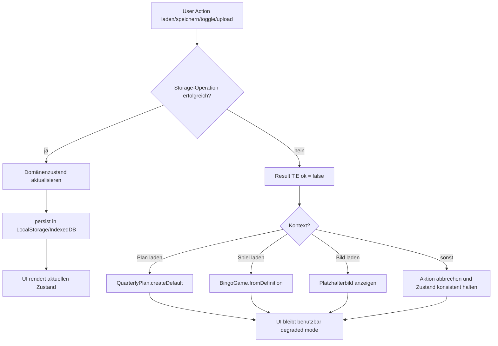

**Fallback-Prinzipien:**

- Fehlertolerant statt Abbruch: Fehler fuehren zu definierten Defaults, nicht zu App-Crashes.
- Konsistenz vor Vollstaendigkeit: Bei Konflikten wird Zustand neu aufgebaut statt halb-gueltig weitergenutzt.
- Benutzerfluss erhalten: Auch ohne Bilder oder mit fehlerhaftem Storage bleibt die Kernfunktion (Planen/Spielen) nutzbar.

**Mapping Fehlerfall -> Reaktion:**

| Fehlerfall | Betroffene Komponente | Reaktion/Fallback | Ergebnis |
| --- | --- | --- | --- |
| Plan kann nicht aus LocalStorage geladen werden | `PlanQuarterlyUseCase` + `LocalStorageQuarterlyPlanRepository` | `persistDefaultQuarterlyPlan()` mit Default-Werten | Edit-Flow bleibt nutzbar |
| Spielstand kann nicht geladen werden | `PlayBingoUseCase` + `LocalStorageBingoGameRepository` | `BingoGame.fromDefinition()` statt Restore | Spiel startet konsistent neu |
| Signatur passt nicht (Plan geaendert) | `PlayBingoUseCase` | Gespeicherten Fortschritt verwerfen, neues Spiel aus aktueller Definition | Kein inkonsistenter Mischzustand |
| Bild kann nicht aus IndexedDB geladen werden | `IndexedDbImageRepository` + UI-Komponenten (`ChallengeCard`, `ProjectComparisonDialog`) | Platzhalter statt Bild anzeigen | Kerninteraktion bleibt erhalten |
| Bildspeicherung schlaegt fehl | `IndexedDbImageRepository` + aufrufender UseCase/Komponente | Aktion ohne Bild abschliessen, bestehenden Zustand beibehalten | Keine Blockade des Spielflusses |
| Schreiben nach LocalStorage schlaegt fehl | `StorageService` + Repository/UseCase | Fehler als `Result` propagieren, keine Exception bis in die UI | UI bleibt stabil (degraded mode) |

### 8.9 UI-Architektur und Atomic Design

Die Presentation-Schicht folgt dem **Atomic Design**-Modell (nach Brad Frost). Komponenten sind in 5 Ebenen organisiert, von Basiselementen zu ganzen Seiten:

#### **Tokens** – Design-System-Fundament

Zentrale SCSS-Variablen definieren Farben, Abstände und Typografie. Sie sind über CSS Custom Properties (`--kq-*`) verfügbar:

**Dateistruktur:** `shared/ui/tokens/`

- `_colors.scss`: Farbpalette (Hintergründe, Text, Primärfarben, Schatten)
  - `--kq-bg`: #f9f1e7 (Creme-Hintergrund)
  - `--kq-primary`: #8f3b22 (Terrakotta-Braun)
  - `--kq-card`: #fffaf2 (Kartenfarbe)

- `_spacing.scss`: Rhythmische Abstände
  - `--kq-space-sm` (0.5rem) bis `--kq-space-2xl` (3rem)
  - `--kq-radius-sm` (4px) bis `--kq-radius-full` (999px)

- `_typography.scss`: Schriftgößen und -gewichte
  - Familie: Avenir Next / Trebuchet MS / Segoe UI
  - Responsive Überschriften (clamp-basiert)

#### **Atoms** – Primitive UI-Bausteine

Kleine, eigenständige Komponenten ohne Business-Logik:

**`icon/icon.component.ts`** (24px × 24px SVG-Icons)

- Input: `name` (home, shuffle, play, print, camera, upload, delete, check, star, close, polaroid, horizontal)
- Input: `size` (px), `strokeWidth`, `filled` (für solide Icons wie Stern)
- Verwendet: Token-basierte Farben

**`button/button.component.ts`** (wiederverwendbarer Button)

- Varianten: `primary`, `secondary`, `icon` (rund 42×42px), `ghost` (transparent mit Rahmen)
- Input: `type` (button|submit), `title`, `ariaLabel`, `disabled`
- Inhalt: Slot-basiert (kann Icon + Text enthalten)

**`badge/badge.component.ts`** (Overlay-Abzeichen)

- Varianten: `done` (grüner Haken), `bingo` (goldener Stern, gefüllt)
- Position: oben links (done) oder oben rechts (bingo) auf Karten
- Abhängig von: `IconComponent`

#### **Molecules** – Zusammengesetzte Komponenten

Kombinationen von Atoms mit begrenzter UI-Logik:

**`challenge-card/challenge-card.component.ts`** (Kern-Element)

- **Inputs:**
  - `name: string` (Challenge-Name)
  - `imageUrl: string | null` (Foto-URL oder null = Platzhalter)
  - `mode: 'polaroid' | 'kompakt'` (Layout-Modus)
  - `done: boolean` (abgehakt?)
  - `inBingo: boolean` (Teil einer Bingo-Reihe?)
  - `showCameraButton?: boolean` (Kamera-Icon anzeigen?)

- **Outputs:**
  - `cameraClicked` (Kamera-Button wurde geklickt)
  - `cardClicked` (Karte wurde angeklickt → Detail-Dialog öffnen)

- **Styles:**
  - Polaroid-Modus: klassische Instant-Film-Optik mit Label unten
  - Kompakt-Modus: Bild links, Name rechts
  - Beim Hover: Haken und Bingo-Stern werden angezeigt

- **Verwendung:** Im `playable-board` (Spiel) und im `editable-board` (Planung)

**`page-toolbar/page-toolbar.component.ts`** (Seiten-Header)

- Navigation: Home, Shuffle, ViewMode-Toggle, Play/Back
- Responsive: wird auf Mobile zu Burger-Menu

#### **Organisms** – Zusammenhängende Seiten-Bereiche

Größere, oft zusammengesetzte Komponenten mit komplexerer Logik:

**`board-grid/board-grid.component.ts`** (4×4-Layout-Container)

- Responsive CSS Grid mit Gap
- Polaroid-Modus: max-width 52rem
- Kompakt-Modus: max-width 58rem
- Breakpoints: 900px (2 Spalten), 520px (1 Spalte)
- Inhalt: beliebige Kinder (typen Challenge-Cards)

**`page-toolbar/page-toolbar.component.ts`** (oben erläutert)

#### **Templates** – Feature-Seiten

Standalone Angular Components, die Organisms und kleinere Feature-spezifische Komponenten kombinieren:

**`quarterly-plan.component.ts` (/quarterly mit future-Quarter)**

- Nutzt: `BoardGridComponent`, `EditableBoardComponent` (nicht in Atoms/Molecules), `CardDetailDialogComponent`
- State: `PlanQuarterlyInPort` (`PlanQuarterlyUseCase`)

**`bingo-game.component.ts` (/quarterly mit current-Quarter)**

- Nutzt: `BoardGridComponent`, `PlayableBoardComponent`, `ProjectComparisonDialogComponent`
- State: `PlayBingoInPort` (`PlayBingoUseCase`)

**`print-bingo-board.component.ts` (/quarterly-print)**

- Nutzt: `BoardGridComponent`, `PrintChallengeCardComponent`
- Zweck: druckoptimierte Darstellung mit mode-abhaengiger Seitenausrichtung und automatischem `window.print()`

**`start-page.component.ts` (/)**

- Einfache Buttons: Primary/Secondary via `KqButtonComponent`

#### **Kompositions-Muster**

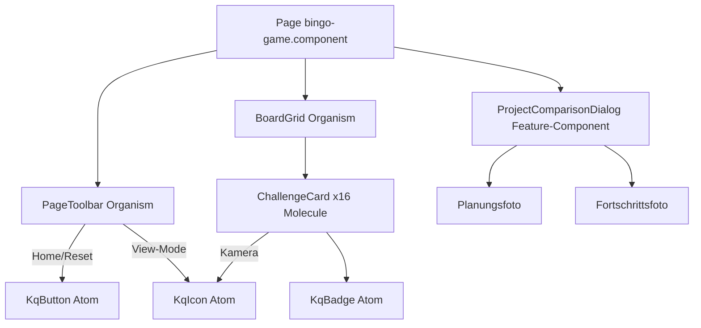

#### **Design Token Integration**

Alle UI-Komponenten referenzieren CSS Custom Properties statt Hard-Coded-Werte:

```scss
/* In challenge-card.scss */
.card {
  background: var(--kq-card);
  border: 2px solid var(--kq-card-border);
  border-radius: var(--kq-radius-lg);
  padding: var(--kq-space-md);
  box-shadow: var(--kq-shadow);
  font-family: var(--kq-font-family);
}

.card.card--done {
  background: var(--kq-bg-soft);  /* subtile Änderung bei Abschluss */
}
```

Vorteil: Themeing oder Brand-Anpassungen erfordern nur Änderung der Token-Variablen, nicht der Komponenten.

### 8.10 Datenmodell – Persistenz

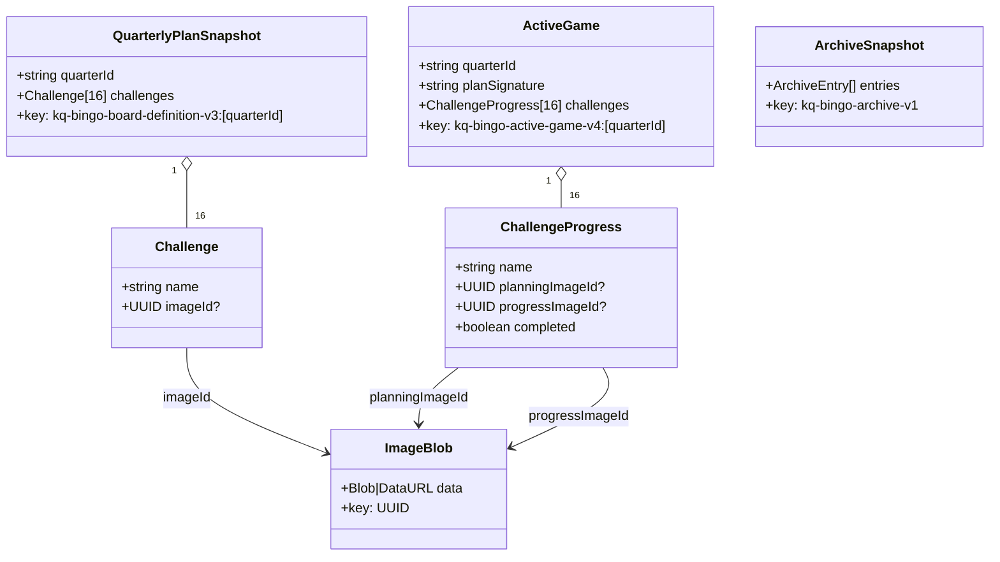

Strukturdaten liegen in LocalStorage. Bilddaten liegen in IndexedDB und werden ueber UUIDs referenziert.

### 8.11 Teststrategie (Unit + E2E)

Die Testpyramide wird in diesem Projekt wie folgt umgesetzt:

- Unit-Tests mit Vitest (`pnpm test`) fuer Domain- und UseCase-Logik
- E2E-Tests mit Playwright (`pnpm test:e2e`) fuer zentrale Nutzerfluesse, Routing und Persistenzintegration
- CI-Ausfuehrung von E2E in GitHub Actions inklusive Playwright-Report als Artefakt
- Smoke-E2E decken zusaetzlich Kompakt-Umschaltung und das Oeffnen des Print-Popups (`/quarterly-print?quarter=...&mode=...`) ab

#### Unit-Test-Konventionen

Testnamen folgen dem Schema `should <erwartetes Verhalten> when/for/on/with <Kontext>`:

```ts
it('should load persisted progress when plan signature matches', () => {
  // given
  ...

  // when
  ...

  // then
  expect(...)
});
```

- Jeder Testname beginnt mit `should` und beschreibt das erwartete Verhalten des Testobjekts.
- Der Kontext (Vorbedingung, Eingabe, Szenario) steht nach `when`, `for`, `on`, `with` oder `without`.
- Testnamen sind auf Englisch.
- Der Testkoerper ist mit `// given`, `// when`, `// then` strukturiert.
- Gibt es keinen eigenen Aktionsschritt (z. B. bei reinen Zustandsabfragen direkt nach der Initialisierung), werden `// when` und `// then` zu `// when + then` zusammengefasst.

#### E2E-Selektor-Strategie

Fuer robuste E2E-Tests werden Selektoren auf `data-testid` standardisiert. Sichtbarer Text wird nur dann verwendet, wenn kein stabiler technischer Anker vorhanden ist.

Namenskonvention:

- `page-*` fuer Seitenanker und Titel
- `action-*` fuer interaktive Controls
- `state-*` fuer Zustandsanzeigen

Beispiele aus der aktuellen Implementierung:

- `page-start-root`
- `action-start-play`
- `action-toolbar-home`
- `action-toolbar-quarter-prev`
- `action-toolbar-quarter-next`
- `state-toolbar-quarter-label`

Regel: Neue kritische Navigationselemente und Kerninteraktionen erhalten bei der Implementierung unmittelbar eine passende `data-testid` gemaess dieser Konvention.

---

## 9. Architekturentscheidungen

### ADR-001: Keine Server-Komponente

**Kontext:** Die App soll einfach betreibbar und offline-fähig sein.  
**Entscheidung:** Vollständige Client-Side-App ohne API. Alle Daten bleiben im Browser.  
**Konsequenzen:** Keine Synchronisation zwischen Geräten. Datenverlust bei Browser-Cache-Löschung möglich.

### ADR-002: DDD mit Ports and Adapters

**Kontext:** Domänenlogik (Bingo-Erkennung, Plan-Verwaltung) soll testbar und framework-unabhängig sein.  
**Entscheidung:** Feature-Slice-Architektur mit domain/application/infrastructure/presentation-Schichten. Storage-Interfaces werden als Ports modelliert; im Code existieren sowohl legacy Domain-Ports (`QUARTERLY_PLAN_READER`, `BINGO_GAME_REPOSITORY`, `IMAGE_REPOSITORY`) als auch feature-spezifische OutPorts (`...OutPort`).  
**Konsequenzen:** Domäne hat keine Angular-Importe. Adapter können in Tests durch Mocks ersetzt werden.

### ADR-003: IndexedDB für Bilder, LocalStorage für strukturierte Daten

**Kontext:** Bilder (als Data-URLs) können mehrere MB groß sein; LocalStorage hat ein Limit von ~5 MB.  
**Entscheidung:** Nur UUIDs werden in LocalStorage referenziert; Binärdaten landen in IndexedDB.  
**Konsequenzen:** Zwei verschiedene Storage-APIs müssen verwaltet werden. Beim Löschen von Challenges müssen referenzierte Bilder-UUIDs nicht zwingend aus IndexedDB entfernt werden (kein referenzielles Delete implementiert – akzeptiertes Tech Debt).

### ADR-004: ChallengeProgress als Value Object statt paralleler Arrays

**Kontext:** Vorherige Implementierung hielt `challenges[]`, `cellImages[]` und `completed[]` als separate parallele Arrays.  
**Entscheidung:** Persistenznahes Value Object `ChallengeProgress { name, planningImageId?, progressImageId?, completed }` fasst alle Daten einer Challenge im `BingoGame` zusammen.  
**Konsequenzen:** Kein Index-Synchronisationsproblem mehr. Klare semantische Trennung zwischen Planungsbild und Fortschrittsfoto. LocalStorage-Migration v2→v3 notwendig.

### ADR-005: Intentionale Port-/UseCase-Benennung und Persistenz-Semantik

**Kontext:** Die bisherige Benennung mischt technische und fachliche Begriffe (z. B. `...Service`, `...Repository`, uneinheitliche Verben). Fuer Ports-and-Adapters soll die Absicht klar erkennbar sein und die Richtung (inbound/outbound) in Namen und Struktur sichtbar werden.

**Entscheidung:**

- Inbound-Ports verwenden das Suffix `InPort` und beschreiben eine fachliche Intention, z. B. `PlanQuarterlyInPort`, `PlayBingoInPort`.
- Application-Implementierungen verwenden das Suffix `UseCase` und implementieren den passenden Inbound-Port, z. B. `PlanQuarterlyUseCase`, `PlayBingoUseCase`.
- Outbound-Ports verwenden das Suffix `OutPort`.
- In Ports und UseCases wird fuer Schreibvorgaenge das Verb `persist...` verwendet.
- Repositories behalten fuer Schreibvorgaenge das Verb `save...` (z. B. `save(...)`).
- Namen folgen einer intentionale Benennung im Muster `Verb + Fachobjekt + Suffix` statt technischer Sammelbegriffe.

**Konsequenzen:**

- Lesbarkeit steigt, weil Richtung und Verantwortung aus dem Namen direkt ersichtlich sind.
- Primäre Adapter (Presentation/Guards) koppeln an `InPort` statt an konkrete Klassen.
- UseCases bleiben austauschbar und testbar; Outbound-Abhaengigkeiten bleiben ueber `OutPort` entkoppelt.
- Migrationsaufwand entsteht durch schrittweises Umbenennen bestehender Services/Ports; empfohlen ist eine inkrementelle Migration pro Feature.

### ADR-006: View-Mode-Trennung durch Unterordner und einheitliches Dateinamen-Suffix

**Kontext:** View-mode-spezifische UI-Komponenten (Desktop, Mobile, Print) waren bisher gemischt benannt: teilweise mit View-Mode als Präfix im Dateinamen (`mobile-bingo-board.component.ts`, `print-bingo-board.component.ts`), teilweise als Suffix (`bingo-game-desktop.component.ts`), teilweise als Infix (`plan-mobile-mini-card.component.ts`). Dadurch war die Zugehörigkeit eines Files zu einem View-Mode nicht auf den ersten Blick erkennbar.

**Entscheidung:**

- Der View-Mode wird **immer als Suffix** im Dateinamen angehängt: `*-desktop`, `*-mobile`, `*-print`.
- View-mode-spezifische Komponenten werden in eigene **Unterordner** des gleichen Namens verschoben: `desktop/`, `mobile/`, `print/`.
- Die **Klassenbezeichnung** folgt demselben Muster: Suffix `Desktop`, `Mobile` oder `Print` am Ende, z. B. `BingoBoardMobileComponent`, `BoardGridDesktopComponent`.
- **Selektoren** folgen demselben Muster: Suffix `-desktop`, `-mobile` oder `-print` am Ende, z. B. `kq-board-grid-desktop`, `kq-challenge-card-mobile`. Geteilte Komponenten in `shared/ui/` verwenden dieses Schema konsequent; Feature-interne Komponenten (`app-*`) behalten ihren Selektor, solange sie nicht in `shared/ui/` leben.
- View-mode-agnostische Komponenten verbleiben in `common/` ohne Modussuffix.
- Alle geteilten UI-Komponenten leben in `src/app/shared/ui/` strukturiert nach Modus (`common/`, `desktop/`, `mobile/`, `print/`) und werden über Barrel-Exports (`index.ts`) bereitgestellt.

**Konsequenzen:**

- Die Ordnerstruktur spiegelt die view-mode-Zugehörigkeit direkt wider: ein `ls desktop/` zeigt alle Desktop-Komponenten eines Features.
- Neue view-mode-spezifische Komponenten in `shared/ui/` müssen zwingend dem Muster `<fachname>-<modus>.component.ts` im passenden Unterordner folgen und den Modus-Suffix im Selektor tragen.
- Imports auf umbenannte Klassen müssen bei Refactorings entsprechend nachgezogen werden.
- Imports aus `shared/ui/` erfolgen ausschließlich über den zentralen Barrel `../../../../shared/ui`.

---

## 10. Qualitätsszenarien

| ID | Szenario | Messung |
| --- | --- | --- |
| Q1 | Seite wird neu geladen während ein Spiel läuft | Spielstand ist vollständig wiederhergestellt (alle Häkchen, alle Bilder) |
| Q2 | Benutzer ändert den Plan nach Spielstart | Spielstand wird verworfen, neues Spiel beginnt automatisch |
| Q3 | Benutzer lädt ein Bild >1 MB hoch | App bleibt responsive; Bild wird in IndexedDB gespeichert |
| Q4 | Alle 16 Challenges einer Zeile abgehakt | Bingo wird sofort (synchron) erkannt und markiert |
| Q5 | Domänenlogik-Test | `pnpm test` läuft in unter 1 Sekunde; keine Angular-Umgebung nötig |
| Q6 | Navigation und Quartalswechsel im Browser | `pnpm test:e2e` läuft in CI erfolgreich; Toolbar-Flows (Home/Help/Prev/Next) sind stabil testbar |
| Q7 | Play-Button: Plan aus Quartal A startet Bingo in aktuellem Quartal B | Challenges aus A sind nach Klick unter B's `quarterId` persistiert; bisheriger Fortschritt in B ist gelöscht; `QuarterlyViewPage` zeigt Spielansicht |
| Q8 | Druckansicht aus dem Spiel öffnen | Print-Popup oeffnet mit korrekten Query-Parametern (`quarter`, `mode`) und ist E2E-abgesichert |

---

## 11. Risiken und technische Schulden

| Risiko / Tech Debt | Beschreibung | Schwere |
| --- | --- | --- |
| Kein Bild-Garbage-Collection | Gelöschte Challenges hinterlassen Bilder-UUIDs in IndexedDB ohne Referenz | Niedrig |
| Kein Multi-Device-Sync | Daten sind lokal im Browser; kein Export/Import | Mittel |
| LocalStorage-Limit | Bei sehr vielen Challenges mit langen Namen könnte das 5 MB-Limit erreicht werden | Niedrig |
| Kein Dark-Mode | UI hat keinen Dark-Mode-Support | Niedrig |

---

## 12. Glossar

| Begriff | Definition |
| --- | --- |
| Adapter | Technische Implementierung eines Ports, z. B. LocalStorage- oder IndexedDB-Zugriff. |
| Aggregate | Konsistenzgrenze im Domänenmodell; hier v. a. `KnittingQuarterly`, `QuarterlyPlan` und `BingoGame`. |
| Atomic Design | UI-Strukturierung in Tokens, Atoms, Molecules, Organisms und Templates. |
| Bingo-Linie | Vollständig abgehakte Reihe, Spalte oder Diagonale im 4x4-Board. |
| Board-Signatur | Serialisierte Darstellung der Challenge-Namen zur Validierung, ob ein Spielstand noch zum aktuellen Plan passt. |
| Challenge | Einzelne Bingo-Aufgabe mit Name und optionalem Planungsbild. |
| ChallengeProgress | Persistenznahes Value Object mit `name`, `planningImageId`, `progressImageId` und `completed` innerhalb von `BingoGame`. |
| Domain-Layer | Schicht mit fachlichen Regeln und domänennahen Objekten ohne Angular- oder Storage-Abhängigkeiten. |
| Fallback | Definierter Ersatzpfad bei Fehlern, z. B. Default-Plan oder Platzhalterbild. |
| KnittingQuarterly | Fachobjekt fuer die zeitliche Quartalseinordnung; aus der Phase (`past` &#124; `current` &#124; `future`) ergeben sich die erlaubten Sichten/Aktionen. |
| IndexedDB | Browser-Datenbank für größere Binärdaten, hier für Bilder. |
| LocalStorage | Browser-Speicher für kompakte strukturierte Daten wie Plan und Spielstand. |
| QuarterlyPlan | Fachbegriff fuer den Plan eines Quartals; identifiziert ueber `quarterId`. |
| Port | Abstrakte Schnittstelle, über die die Application-Schicht Infrastruktur anspricht. |
| Progress-Bild | Während der Spielphase aufgenommenes Foto (`progressImageId`). |
| Planungsbild | In der Planungsphase hinterlegtes Referenzbild (`planningImageId`). |
| Result<T, E> | Typsicheres Erfolgs-/Fehlerobjekt statt Exception-Flow in UseCases/Repositories. |
| Value Object | Unveränderliches Objekt ohne eigene Identität, beschrieben über seine Werte. |
