# arc42 Architekturdokumentation – Knitting Quarterly Bingo

> Basierend auf arc42 Template Version 8 (https://arc42.org)

---

## 1. Einführung und Ziele

### 1.1 Aufgabenstellung

Knitting Quarterly Bingo ist eine browserbasierte Einzelplatz-Webanwendung, mit der Strickerinnen und Stricker ein persönliches Bingo-Spielfeld für einen Strick-Quartal befüllen und während des Quartals ihren Fortschritt verfolgen können.

Die Anwendung unterstützt zwei Phasen:

1. **Planungsphase**: Der Jahresplan wird als Liste von Challenges (Strick-Vorhaben) zusammengestellt. Zu jeder Challenge kann ein Planungsbild (z. B. Inspirationsfoto aus Ravelry) hinterlegt werden.
2. **Spielphase**: Das Bingo-Brett wird angezeigt. Erfüllte Challenges werden abgehakt. Zu jeder erfüllten Challenge kann ein Fortschrittsfoto hochgeladen werden. Werden genug Challenges in einer Zeile, Spalte oder Diagonale abgehakt, entsteht Bingo.

### 1.2 Qualitätsziele

| Priorität | Qualitätsmerkmal | Konkrete Ausprägung |
|---|---|---|
| 1 | Offline-Fähigkeit | Keine Serverabhängigkeit; alles im Browser persistiert |
| 2 | Einfache Bedienbarkeit | Wenige Screens, direktes Interaktionsmodell |
| 3 | Datenkonsistenz | Spielstand wird bei jedem Schritt gespeichert; kein Datenverlust bei Reload |
| 4 | Testbarkeit | Domänenlogik ist framework-unabhängig und vollständig unit-testbar |
| 5 | Erweiterbarkeit | Ports-and-Adapters erlaubt Austausch von Storage-Technologien |

### 1.3 Stakeholder

| Rolle | Erwartung |
|---|---|
| Strickerin / Stricker | Einfache, schnelle App zum Tracken des eigenen Quartals-Bingos |
| Entwicklerin | Klare Architektur, gute Testbarkeit, keine externe Abhängigkeiten im Betrieb |

---

## 2. Randbedingungen

### Technische Randbedingungen

- **Laufzeitumgebung**: Moderner Webbrowser (Chrome, Firefox, Safari)
- **Kein Backend**: Vollständige Client-Side-Applikation, keine Server-Komponente
- **Persistence**: Browser-APIs (LocalStorage für strukturierte Daten, IndexedDB für Bilder)
- **Framework**: Angular 17+ (Standalone Components, Signals)
- **Sprache**: TypeScript
- **Tests**: Vitest

### Organisatorische Randbedingungen

- Betrieb als statische Webanwendung (via Docker / nginx oder direkt aus `dist/`)
- Keine Benutzerkonten, kein Login – alle Daten bleiben lokal im Browser

---

## 3. Kontextabgrenzung

### 3.1 Systemkontext

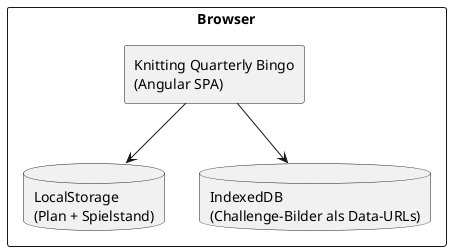

**Externe Schnittstellen:** keine. Die Anwendung kommuniziert ausschließlich mit Browser-APIs.

---

## 4. Lösungsstrategie

| Entscheidung | Begründung |
|---|---|
| **Domain-Driven Design** | Komplexe Domänenlogik (Bingo-Erkennung, Spielstand-Validierung, Bild-Konzepte) lebt isoliert im Domain-Layer |
| **Ports and Adapters** | Storage-Technologien (LocalStorage, IndexedDB) sind austauschbar; Domäne kennt nur Interfaces (Ports) |
| **Immutable Value Objects** | `BingoGame` und `QuarterlyPlan` sind unveränderliche Aggregate; jede Mutation liefert eine neue Instanz |
| **Angular Signals** | Reaktiver State ohne RxJS-Overhead; Services halten `signal<Aggregate>()` und leiten `computed()`-Werte ab |
| **Feature-Slice-Struktur** | Klare Trennung nach Features mit eigenem domain/application/infrastructure/presentation-Stack |
| **Atomic Design (UI)** | UI-Komponenten sind als Tokens, Atoms, Molecules und Organisms strukturiert; fördert Wiederverwendung, konsistentes Design und klare Verantwortlichkeiten in der Presentation-Schicht |

---

## 5. Bausteinsicht

### 5.1 Ebene 1 – Gesamtsystem

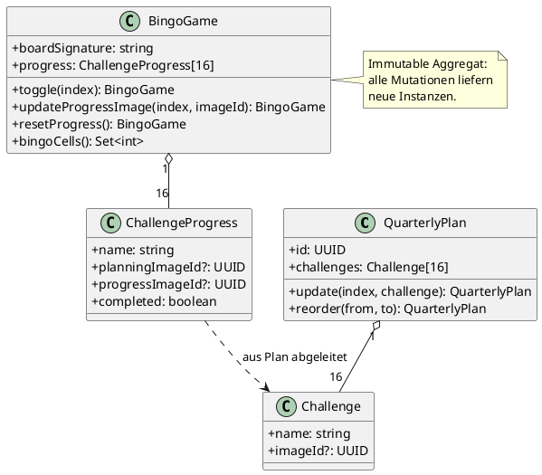

### 5.2 Architekturbild – Ports and Adapters

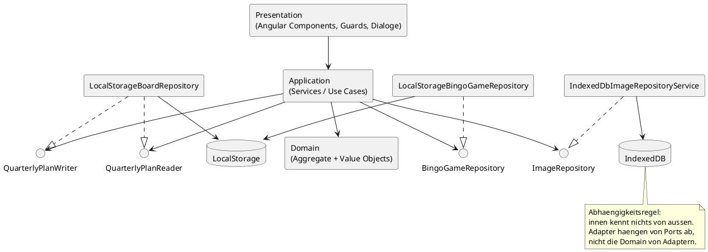

**Kernelemente und Verantwortlichkeiten:**

- `QuarterlyPlan`: Unveraenderliches Planungs-Aggregat fuer die 16 Challenges (Bearbeiten, Umordnen).
- `BingoGame`: Unveraenderliches Spiel-Aggregat fuer Fortschritt und Bingo-Erkennung.
- Ports (`QuarterlyPlanReader/Writer`, `BingoGameRepository`, `ImageRepository`): Definieren die von der Applikation benoetigte Persistenz.
- Adapter (`LocalStorage...`, `IndexedDb...`): Implementieren Ports und kapseln Browser-APIs inklusive Migrationen.
- Presentation + Application: UI loest Use Cases aus; Services orchestrieren Domain + Ports.

---

## 6. Laufzeitsicht

### Szenario 1: Erstaufruf – kein Plan vorhanden

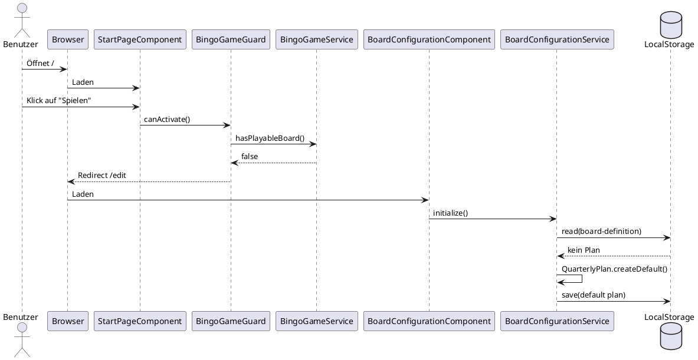

### Szenario 2: Plan bearbeiten

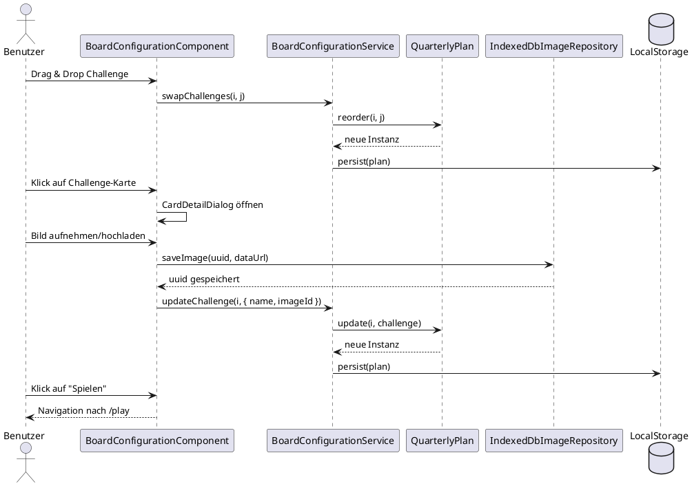

### Szenario 3: Spiel spielen

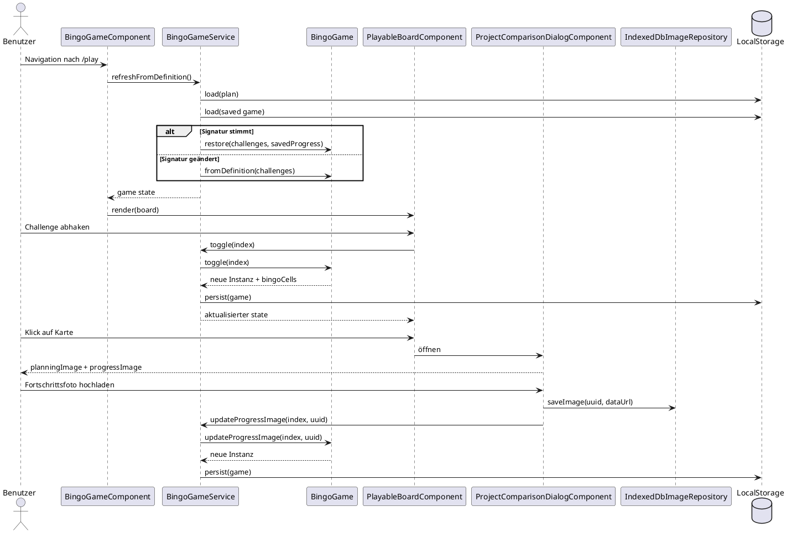

### 6.4 Zustandsmodell – Spiellebenszyklus

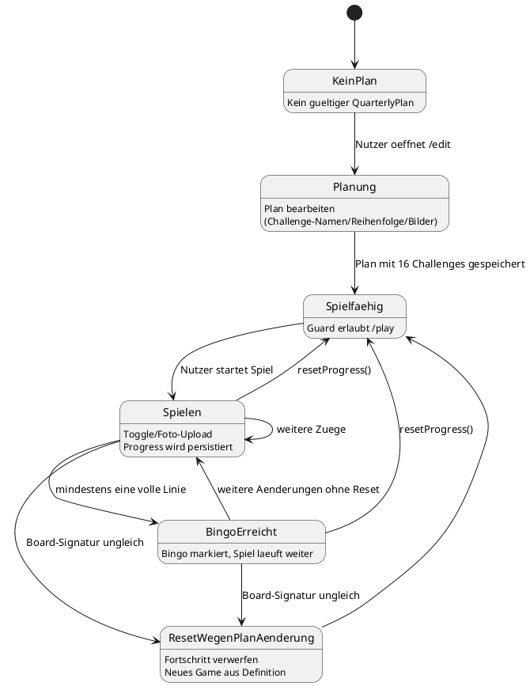

---

## 7. Verteilungssicht

Die Anwendung wird als statische Webanwendung ausgeliefert. Es gibt nur eine Laufzeitumgebung: den Browser des Benutzers.

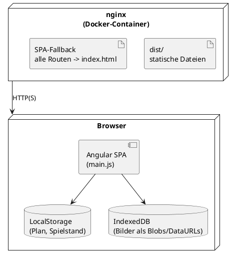

**Deployment:** `docker-compose up` baut die App und startet nginx. Konfiguration in `Dockerfile` und `docker-compose.yml`.

---

## 8. Querschnittliche Konzepte

### 8.1 Persistenz-Strategie

Zwei Storage-Technologien, klar nach Datentyp getrennt:

| Daten | Technologie | Schlüssel |
|---|---|---|
| Quartalsplan | LocalStorage | `kq-bingo-board-definition-v2` |
| Spielfortschritt | LocalStorage | `kq-bingo-active-game-v3` |
| Challenge-Bilder (Planung + Fortschritt) | IndexedDB | UUIDs als Objekt-Store-Keys |

Bilder werden **nie** direkt im Plan oder Spielstand gespeichert – nur ihre UUIDs. Das hält LocalStorage klein und ermöglicht große Bilder in IndexedDB.

### 8.2 Datenmigration

Beide Repositories enthalten automatische Migrationslogik beim Laden:

- `LocalStorageBoardRepository`: v1 (kein `id`-Feld) → v2 (mit UUID)
- `LocalStorageBingoGameRepository`: v2 (separate `cellImages[]` + `completed[]`-Arrays) → v3 (`ChallengeProgress[]`)

Migrationen laufen transparent beim ersten Laden nach einem Update. Alte Schlüssel werden nicht gelöscht, um einen Rollback nicht zu verunmöglichen.

### 8.3 Unveränderliche Domänen-Aggregate

Alle Aggregate (`BingoGame`, `QuarterlyPlan`) sind immutable:

- Private Konstruktoren, nur statische Factory-Methoden
- Jede Mutation erzeugt eine neue Instanz
- Services halten Aggregate in Angular-`signal()`-Containern

Vorteil: keine defensive Kopien nötig, keine unbeabsichtigten Seiteneffekte, direkte Testbarkeit ohne Mocks.

### 8.4 Bild-Konzept: Planungsbild vs. Fortschrittsfoto

`ChallengeProgress` unterscheidet explizit zwei Bildkonzepte:

- **`planningImageId`**: Bild, das in der Planungsphase zur Challenge hinterlegt wurde (z. B. Inspirationsbild). Wird beim Spielstart aus dem `QuarterlyPlan` kopiert.
- **`progressImageId`**: Foto, das der Benutzer während des Spiels aufnimmt, wenn er die Challenge erfüllt.

Der Dialog `ProjectComparisonDialogComponent` zeigt beide Bilder nebeneinander und ermöglicht so einen Soll-/Ist-Vergleich.

### 8.5 Bingo-Erkennung

`BingoGame.bingoCells` berechnet alle Indices, die Teil einer vollständigen Linie sind:

- 4 Zeilen × 4 Felder
- 4 Spalten × 4 Felder
- 2 Diagonalen × 4 Felder

Gibt ein `Set<number>` zurück. Mehrere gleichzeitige Bingos sind möglich (ein Feld kann Teil mehrerer Linien sein).

### 8.6 Signatur-basierte Spielstand-Validierung

Wenn der Benutzer den Plan nach dem Start eines Spiels ändert, würde der alte Spielstand nicht mehr passen. `createBoardSignature()` serialisiert die Namen aller Challenges als JSON-String. Beim Laden des Spielstands wird die gespeicherte Signatur gegen die aktuelle verglichen – bei Abweichung wird ein neues Spiel gestartet.

### 8.7 Fehlerbehandlung

Fehler aus Storage-Operationen werden als `Result<T, E>` zurückgegeben (typsicheres Either-Pattern). Services reagieren auf `result.ok === false` mit Fallback-Verhalten (leerer Plan / leeres Spiel), nicht mit Exceptions.

### 8.8 Fehler- und Fallback-Sicht

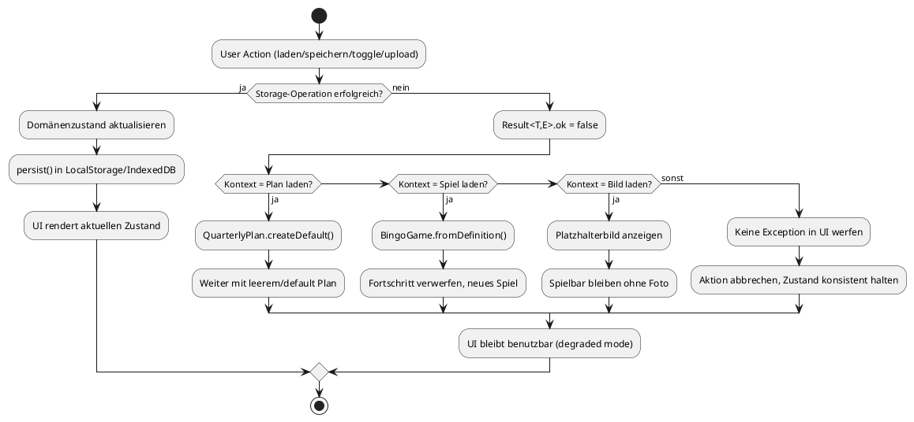

**Fallback-Prinzipien:**

- Fehlertolerant statt Abbruch: Fehler fuehren zu definierten Defaults, nicht zu App-Crashes.
- Konsistenz vor Vollstaendigkeit: Bei Konflikten wird Zustand neu aufgebaut statt halb-gueltig weitergenutzt.
- Benutzerfluss erhalten: Auch ohne Bilder oder mit fehlerhaftem Storage bleibt die Kernfunktion (Planen/Spielen) nutzbar.

**Mapping Fehlerfall -> Reaktion:**

| Fehlerfall | Betroffene Komponente | Reaktion/Fallback | Ergebnis |
|---|---|---|---|
| Plan kann nicht aus LocalStorage geladen werden | `BoardConfigurationService` + `LocalStorageBoardRepository` | `QuarterlyPlan.createDefault()` und Persistenz mit Default-Werten | Edit-Flow bleibt nutzbar |
| Spielstand kann nicht geladen werden | `BingoGameService` + `LocalStorageBingoGameRepository` | `BingoGame.fromDefinition()` statt Restore | Spiel startet konsistent neu |
| Signatur passt nicht (Plan geaendert) | `BingoGameService` | Gespeicherten Fortschritt verwerfen, neues Spiel aus aktueller Definition | Kein inkonsistenter Mischzustand |
| Bild kann nicht aus IndexedDB geladen werden | `IndexedDbImageRepositoryService` + UI-Komponenten (`ChallengeCard`, `ProjectComparisonDialog`) | Platzhalter statt Bild anzeigen | Kerninteraktion bleibt erhalten |
| Bildspeicherung schlaegt fehl | `IndexedDbImageRepositoryService` + aufrufender Service | Aktion ohne Bild abschliessen, bestehenden Zustand beibehalten | Keine Blockade des Spielflusses |
| Schreiben nach LocalStorage schlaegt fehl | `StorageService` + aufrufender Service | Fehler als `Result` propagieren, keine Exception bis in die UI | UI bleibt stabil (degraded mode) |

### 8.9 UI-Architektur und Atomic Design

Die Presentation-Schicht folgt dem **Atomic Design**-Modell (nach Brad Frost). Komponenten sind in 4 Ebenen organisiert, von Basislelementen zu ganzen Seiten:

#### **Tokens** – Design-System-Fundament

Zentrale SCSS-Variablen definieren Farben, Abstände und Typografie. Sie sind über CSS Custom Properties (`--kq-*`) verfügbar:

**Dateistruktur:** `shared/ui/tokens/`
- `_colors.scss`: Farbpalette (Hintergründe, Text, Primärfarben, Schatten)
  - `--kq-bg`: #f9f1e7 (Creme-Hintergrund)
  - `--kq-primary`: #8f3b22 (Terrakotta-Braun)
  - `--kq-card`: #fffaf2 (Kartenfarbe)

- `_spacing.scss`: Rhythmische Abstände
  - `--kq-space-sm` (0.5rem) bis `--kq-space-2xl` (3rem)
  - `--kq-radius-sm` (4px) bis `--kq-radius-full` (999px)

- `_typography.scss`: Schriftgößen und -gewichte
  - Familie: Avenir Next / Trebuchet MS / Segoe UI
  - Responsive Überschriften (clamp-basiert)

#### **Atoms** – Primitive UI-Bausteine

Kleine, eigenständige Komponenten ohne Business-Logik:

**`icon/icon.component.ts`** (24px × 24px SVG-Icons)
- Input: `name` (home, shuffle, play, camera, upload, delete, check, star, close, polaroid, horizontal)
- Input: `size` (px), `strokeWidth`, `filled` (für solide Icons wie Stern)
- Verwendet: Token-basierte Farben

**`button/button.component.ts`** (wiederverwendbarer Button)
- Varianten: `primary`, `secondary`, `icon` (rund 42×42px), `ghost` (transparent mit Rahmen)
- Input: `type` (button|submit), `title`, `ariaLabel`, `disabled`
- Inhalt: Slot-basiert (kann Icon + Text enthalten)

**`badge/badge.component.ts`** (Overlay-Abzeichen)
- Varianten: `done` (grüner Haken), `bingo` (goldener Stern, gefüllt)
- Position: oben links (done) oder oben rechts (bingo) auf Karten
- Abhängig von: `IconComponent`

#### **Molecules** – Zusammengesetzte Komponenten

Kombinationen von Atoms mit begrenzter UI-Logik:

**`challenge-card/challenge-card.component.ts`** (Kern-Element)
- **Inputs:**
  - `name: string` (Challenge-Name)
  - `imageUrl: string | null` (Foto-URL oder null = Platzhalter)
  - `mode: 'polaroid' | 'horizontal'` (Layout-Modus)
  - `done: boolean` (abgehakt?)
  - `inBingo: boolean` (Teil einer Bingo-Reihe?)
  - `showCameraButton?: boolean` (Kamera-Icon anzeigen?)

- **Outputs:**
  - `cameraClicked` (Kamera-Button wurde geklickt)
  - `cardClicked` (Karte wurde angeklickt → Detail-Dialog öffnen)

- **Styles:**
  - Polaroid-Modus: klassische Instant-Film-Optik mit Label unten
  - Horizontal-Modus: Bild links, Name rechts
  - Beim Hover: Haken und Bingo-Stern werden angezeigt

- **Verwendung:** Im `playable-board` (Spiel) und im `editable-board` (Planung)

**`page-toolbar/page-toolbar.component.ts`** (Seiten-Header)
- Navigation: Home, Shuffle, ViewMode-Toggle, Play/Back
- Responsive: wird auf Mobile zu Burger-Menu

#### **Organisms** – Zusammenhängende Seiten-Bereiche

Größere, oft zusammengesetzte Komponenten mit komplexerer Logik:

**`board-grid/board-grid.component.ts`** (4×4-Layout-Container)
- Responsive CSS Grid mit Gap
- Polaroid-Modus: max-width 52rem
- Horizontal-Modus: max-width 58rem
- Breakpoints: 900px (2 Spalten), 520px (1 Spalte)
- Inhalt: beliebige Kinder (typen Challenge-Cards)

**`page-toolbar/page-toolbar.component.ts`** (oben erläutert)

#### **Templates** – Feature-Seiten

Standalone Angular Components, die Organisms und kleinere Feature-spezifische Komponenten kombinieren:

**`board-configuration.component.ts` (/edit)**
- Nutzt: `BoardGridComponent`, `EditableBoardComponent` (nicht in Atoms/Molecules), `CardDetailDialogComponent`
- State: `BoardConfigurationService`

**`bingo-game.component.ts` (/play)**
- Nutzt: `BoardGridComponent`, `PlayableBoardComponent`, `ProjectComparisonDialogComponent`
- State: `BingoGameService`

**`start-page.component.ts` (/)**
- Einfache Buttons: Primary/Secondary via `KqButtonComponent`

#### **Kompositions-Muster**

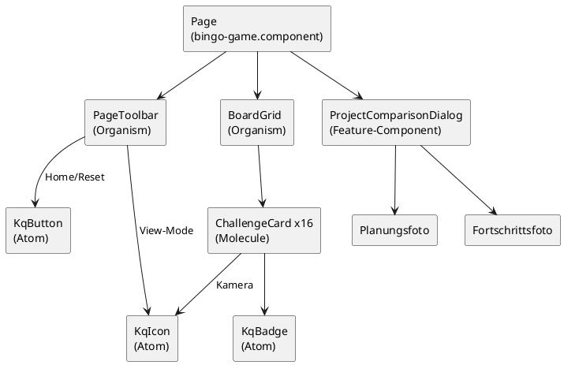

#### **Design Token Integration**

Alle UI-Komponenten referenzieren CSS Custom Properties statt Hard-Coded-Werte:

```scss
/* In challenge-card.scss */
.card {
  background: var(--kq-card);
  border: 2px solid var(--kq-card-border);
  border-radius: var(--kq-radius-lg);
  padding: var(--kq-space-md);
  box-shadow: var(--kq-shadow);
  font-family: var(--kq-font-family);
}

.card.card--done {
  background: var(--kq-bg-soft);  /* subtile Änderung bei Abschluss */
}
```

Vorteil: Themeing oder Brand-Anpassungen erfordern nur Änderung der Token-Variablen, nicht der Komponenten.

### 8.10 Datenmodell – Persistenz

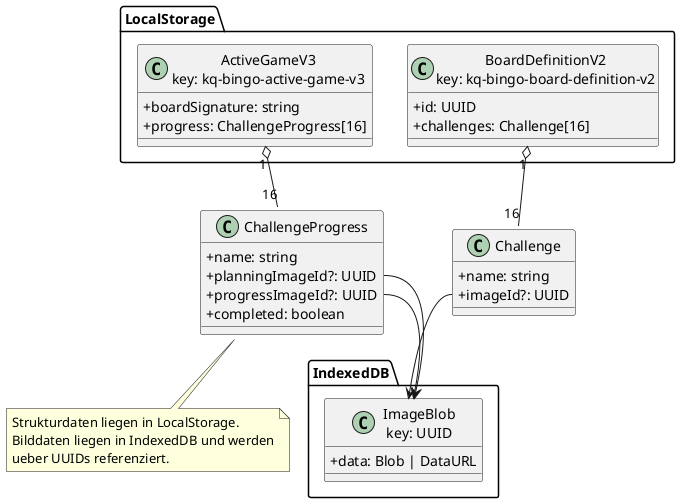

---

## 9. Architekturentscheidungen

### ADR-001: Keine Server-Komponente

**Kontext:** Die App soll einfach betreibbar und offline-fähig sein.  
**Entscheidung:** Vollständige Client-Side-App ohne API. Alle Daten bleiben im Browser.  
**Konsequenzen:** Keine Synchronisation zwischen Geräten. Datenverlust bei Browser-Cache-Löschung möglich.

### ADR-002: DDD mit Ports and Adapters

**Kontext:** Domänenlogik (Bingo-Erkennung, Plan-Verwaltung) soll testbar und framework-unabhängig sein.  
**Entscheidung:** Feature-Slice-Architektur mit domain/application/infrastructure/presentation-Schichten. Storage-Interfaces als Ports (`QUARTERLY_PLAN_READER`, `BINGO_GAME_REPOSITORY`, `IMAGE_REPOSITORY`).  
**Konsequenzen:** Domäne hat keine Angular-Importe. Adapter können in Tests durch Mocks ersetzt werden.

### ADR-003: IndexedDB für Bilder, LocalStorage für strukturierte Daten

**Kontext:** Bilder (als Data-URLs) können mehrere MB groß sein; LocalStorage hat ein Limit von ~5 MB.  
**Entscheidung:** Nur UUIDs werden in LocalStorage referenziert; Binärdaten landen in IndexedDB.  
**Konsequenzen:** Zwei verschiedene Storage-APIs müssen verwaltet werden. Beim Löschen von Challenges müssen referenzierte Bilder-UUIDs nicht zwingend aus IndexedDB entfernt werden (kein referenzielles Delete implementiert – akzeptiertes Tech Debt).

### ADR-004: ChallengeProgress als Value Object statt paralleler Arrays

**Kontext:** Vorherige Implementierung hielt `challenges[]`, `cellImages[]` und `completed[]` als separate parallele Arrays.  
**Entscheidung:** Value Object `ChallengeProgress { name, planningImageId?, progressImageId?, completed }` fasst alle Daten einer Challenge zusammen.  
**Konsequenzen:** Kein Index-Synchronisationsproblem mehr. Klare semantische Trennung zwischen Planungsbild und Fortschrittsfoto. LocalStorage-Migration v2→v3 notwendig.

---

## 10. Qualitätsszenarien

| ID | Szenario | Messung |
|---|---|---|
| Q1 | Seite wird neu geladen während ein Spiel läuft | Spielstand ist vollständig wiederhergestellt (alle Häkchen, alle Bilder) |
| Q2 | Benutzer ändert den Plan nach Spielstart | Spielstand wird verworfen, neues Spiel beginnt automatisch |
| Q3 | Benutzer lädt ein Bild >1 MB hoch | App bleibt responsive; Bild wird in IndexedDB gespeichert |
| Q4 | Alle 16 Challenges einer Zeile abgehakt | Bingo wird sofort (synchron) erkannt und markiert |
| Q5 | Domänenlogik-Test | `pnpm test --run` läuft in unter 1 Sekunde; keine Angular-Umgebung nötig |

---

## 11. Risiken und technische Schulden

| Risiko / Tech Debt | Beschreibung | Schwere |
|---|---|---|
| Kein Bild-Garbage-Collection | Gelöschte Challenges hinterlassen Bilder-UUIDs in IndexedDB ohne Referenz | Niedrig |
| Kein Multi-Device-Sync | Daten sind lokal im Browser; kein Export/Import | Mittel |
| LocalStorage-Limit | Bei sehr vielen Challenges mit langen Namen könnte das 5 MB-Limit erreicht werden | Niedrig |
| Kein Dark-Mode | UI hat keinen Dark-Mode-Support | Niedrig |

---

## 12. Glossar

| Begriff | Definition |
|---|---|
| Adapter | Technische Implementierung eines Ports, z. B. LocalStorage- oder IndexedDB-Zugriff. |
| Aggregate | Konsistenzgrenze im Domänenmodell; hier v. a. `QuarterlyPlan` und `BingoGame`. |
| Atomic Design | UI-Strukturierung in Tokens, Atoms, Molecules, Organisms und Templates. |
| Bingo-Linie | Vollständig abgehakte Reihe, Spalte oder Diagonale im 4x4-Board. |
| Board-Signatur | Serialisierte Darstellung der Challenge-Namen zur Validierung, ob ein Spielstand noch zum aktuellen Plan passt. |
| Challenge | Einzelne Bingo-Aufgabe mit Name und optionalem Planungsbild. |
| ChallengeProgress | Value Object mit `name`, `planningImageId`, `progressImageId` und `completed`. |
| Domain-Layer | Schicht mit fachlichen Regeln und domänennahen Objekten ohne Angular- oder Storage-Abhängigkeiten. |
| Fallback | Definierter Ersatzpfad bei Fehlern, z. B. Default-Plan oder Platzhalterbild. |
| IndexedDB | Browser-Datenbank für größere Binärdaten, hier für Bilder. |
| LocalStorage | Browser-Speicher für kompakte strukturierte Daten wie Plan und Spielstand. |
| Port | Abstrakte Schnittstelle, über die die Application-Schicht Infrastruktur anspricht. |
| Progress-Bild | Während der Spielphase aufgenommenes Foto (`progressImageId`). |
| Planungsbild | In der Planungsphase hinterlegtes Referenzbild (`planningImageId`). |
| Result<T, E> | Typsicheres Erfolgs-/Fehlerobjekt statt Exception-Flow in Services. |
| Value Object | Unveränderliches Objekt ohne eigene Identität, beschrieben über seine Werte. |
